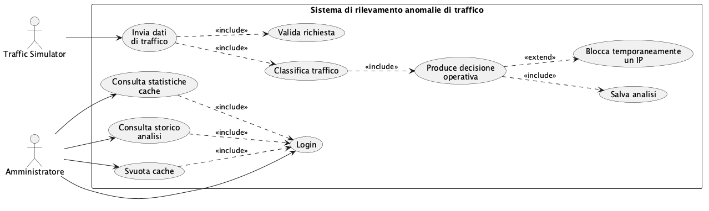
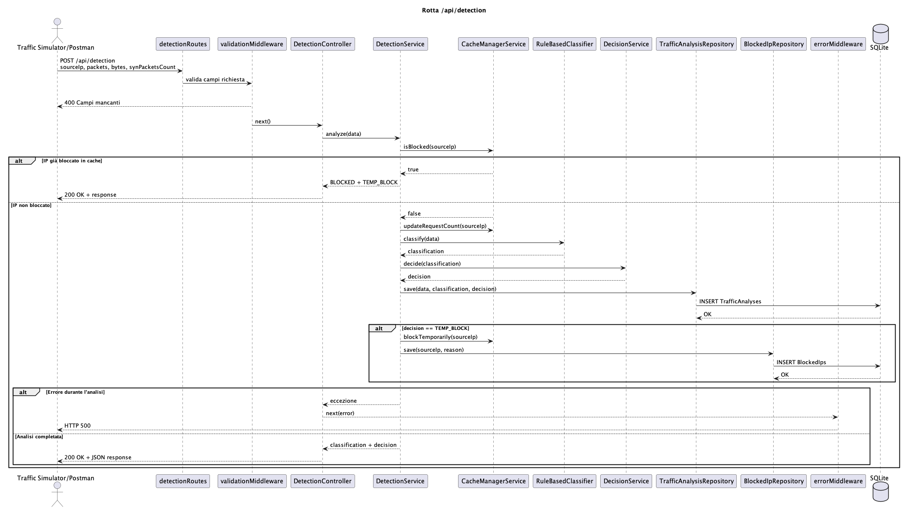
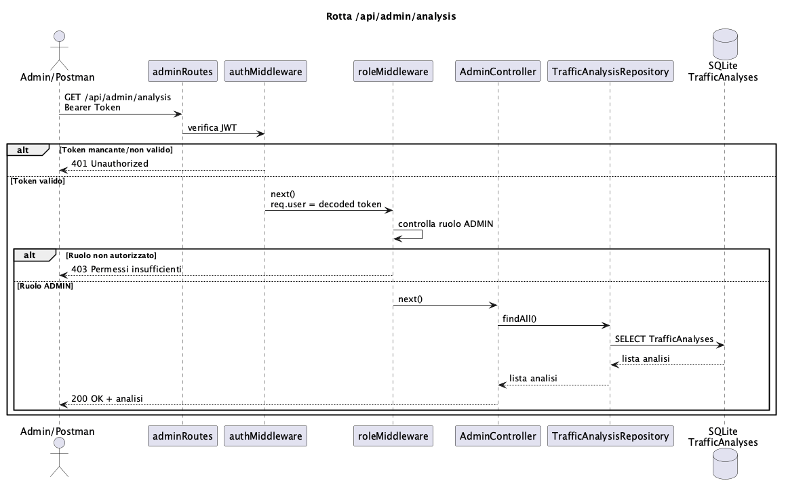
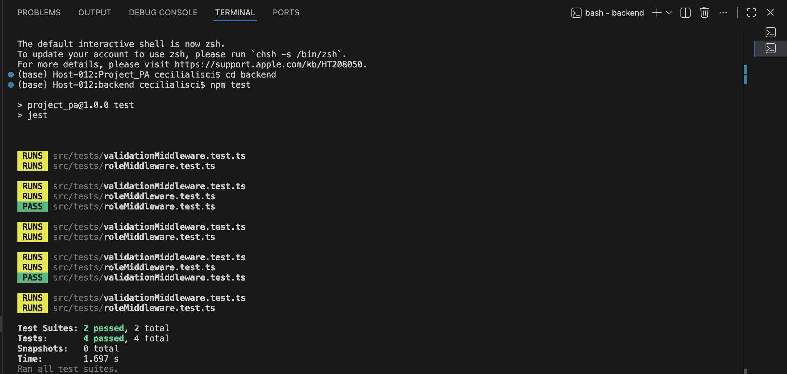

# Sistema multi-utente per il rilevamento di attacchi di rete basato su architettura client-server

Il sistema sviluppato si inserisce in un contesto applicativo in cui è necessario monitorare il traffico di rete per individuare possibili attività sospette.
Nell'infrastruttura ipotizzata, infatti, più client o utenti possono generare traffico verso un backend centrale, mentre un sistema di analisi si occupa di elaborare i flussi ricevuti e segnalare eventuali comportamenti anomali.

## Obiettivo del progetto

Il presente progetto simula tale scenario attraverso l'impiego di un'architettura client-server, all'interno della quale il client invia al backend richieste contenenti feature estratte da flussi di rete.
Nello specifico, sono state selezionate quattro features:
- **sourceIP**, ovvero l'indirizzo sorgente del traffico, che identidica l'host che genera i pacchetti;
- **packets**, cioè il numero dei pacchetti inviati in un intervallo di tempo specifico, utile per individuare il volume di traffico anomalo;
- **bytes**, ovvero la quantità totale di bytes trasmessi nella comunicazione tra client (host) e service;
- **synPacketsCount**, cioè l numero di pacchetti TCP che possiedono la flag SYN, che costituisce una caratteristica rilevante nell'osservazione del traffico di rete, per individuare attacchi SYN Flood;

Nello specifico, il backend riceve le richieste tramite API REST sviluppate con Node.js, Express e TypeScript, quindi verifica autenticazione e autorizzazione mediante token JWT, e poi valida i dati ricevuti e avvia la pipeline di elaborazione.

Il traffico viene classificato tramite un approccio rule-based, basato su regole e soglie predefinite, distinguendo tra:
- traffico benigno
- attacchi DoS
- tentativi di Brute Force

Sulla base della classificazione ottenuta, il sistema produce una decisione operativa tra: consentire la richiesta, generare un avviso o applicare un blocco temporaneo oppure uno permanente.

Il sistema include inoltre una componente di persistenza dei dati basata sull'utilizzo di database relazionale esterno, interfacciato mediante Sequelize, così da memorizzare le analisi effettuate e mantenere uno storico delle richieste analizzate.

Le informazioni salvate possono essere consultate attraverso rotte protette riservate agli utenti amministratori.

## Strumenti per lo sviluppo

- Node.JS
- Express
- TypeScript
- Sequelize
- SQLite
- JWT
- Docker
- Jest
- Postman

## Diagrammi UML

### Diagramma dei casi d'uso




### Diagramma di sequenza

#### Rotta /api/auth/login
<p align="center">

</p>

Questa rotta autentica l'utente verificando username e password forniti.
Se le credenziali inserite sono corrette, il server genera e restituisce un token JWT.
Nella collection Postman è stato configurato uno **script Post-response** che, al termine di un login eseguito con successo, estrae automaticamente il token della risposta e lo salva nella variabile `token` contenuta nell'Environment: 
```bash
const response = pm.response.json();
pm.environment.set("token", response.token);
```
In questo modo, tutte le richieste protette da eseguire successivamente possono utilizzare automaticamente il token, senza la necessità di 
inserirlo manualmente nell'_header Authorization_.
L'_header Authorization_ è uno degli header della richiesta HTTP che il client invia, e serve per trasmettere le credenziali di autenticazione al server; nello specifico, contiene il token utilizzando lo schema Bearer definito dallo standard HTTP
```bash
Authorization: Bearer <JWT>
```

Il flusso di esecuzione della rotta è il seguente:
- Il client (Postman) invia una richiesta `POST` all'endpoint `/api/auth/login`, contenente username e password
- La richiesta viene intercettata da `authRoutes`, che la inoltra al metodo `login()` dell'`AuthController`
- L'`AuthController` estrae le credenziali dalla richiesta e richiama il metodo `login()` dell'`AuthService`
- L'`AuthService` utilizza il `UserRepository` per cercare l'utente nel database SQLite tramite il metodo `findByUsername()`
- Lo `UserRepository` esegue una query sul database e restituisce i dati dell'utente eventualmente presente; se l'utente non esiste
il server restituisce un'eccezione `Credenziali non valide`
- L'`AuthService` quindi verifica che la password fornita corrisponda a quella memorizzata nel database tramite il metodo `bcrypt.compare()`
- Se le credenziali sono corrette, viene generato un token JWT e il server restituisce una risposta `HTTP 200 OK` contenente il token; se invece le credenziali non sono valide, viene restituita un'eccezione contenente il messaggio `Credenziali non valide`


#### Rotta /api/detection
<p align="center">

</p>

Questa rotta riceve i dati di traffico provenienti dal client e li analizza per individuare eventuali attacchi di rete.
Il flusso di esecuzione della rotta è il seguente:
- Il client invia una richiesta `POST` all'endpoint `/api/detection`
- La richiesta viene intercettata da `detectionRoutes`, che la inoltra al `validationMiddleware`
- Il `validationMiddlewar`e verifica che tutti i campi obbligatori siano presenti; se alcuni parametri mancano, la richiesta viene interrotta e viene restituita una risposta `HTTP 400 Bad Request`. Se la validazione ha esito positivo, la richiesta viene inoltrata al `DetectionController`
- Il `DetectionController` richiama il metodo `analyze()` del `DetectionService`
- Il `DetectionService` verifica, tramite il `CacheManagerService`, se l'indirizzo IP sorgente è già temporaneamente bloccato tramite il metodo `isBlocked()`. Di qui possono verificarsi due casi:
  - Caso 1 – IP già bloccato
    se l'IP risulta già presente nella cache dei blocchi temporanei, il servizio restituisce immediatamente l'esito `BLOCKED + TEMP_BLOCK`, ed il client riceve una risposta `HTTP 200 OK` contenente l'esito

  - Caso 2 – IP non bloccato
    Il `DetectionService` aggiorna il contatore delle richieste dell'IP sorgente attraverso il metodo `updateRequestCount()` del `CacheManagerService`, e successivamente invia i dati al `RuleBasedClassifier`, che esegue la classificazione del traffico.
    Quindi, il risultato della classificazione viene passato al `DecisionService` che determina la decisione finale ad esso associata.
    L'analisi effettuata viene poi salvata nel database tramite il `TrafficAnalysisRepository`.
    Se la decisione finale corrisponde a `TEMP_BLOCK`, il `BlockedIpRepository` salva anche le informazioni relative al blocco dell'indirizzo IP.
    Infine il `DetectionService` restituisce al `DetectionController` la classificazione e la decisione ottenute, che vengono inviate al client in formato JSON con risposta `HTTP 200 OK`.

Se durante l'elaborazione si verifica un'eccezione, questa viene inoltrata all'`errorMiddleware`, che restituisce una risposta `HTTP 500 Internal Server Error`.


#### Rotta /api/admin/statistics
<p align="center">

</p>

Questa rotta consente ad un amministratore autenticato di recuperare le statistiche del sistema.
Il flusso di esecuzione della rotta è il seguente:
- Il client (Admin/Postman) invia una richiesta `GET` all'endpoint `/api/admin/statistics`, includendo il Bearer Token nell'_header Authorization_
- La richiesta viene intercettata da `adminRoutes`, che la inoltra all'`authMiddleware`
- L'`authMiddleware` verifica la validità del token JWT:
  - se il token è assente o non valido, la richiesta viene interrotta e il server restituisce una risposta `HTTP 401 Unauthorized`.
  - se il token è valido, l'`authMiddleware` decodifica il token, salva le informazioni dell'utente in `req.user` e richiama  la funzione `next()` per proseguire l'elaborazione della richiesta
- La richiesta viene quindi inoltrata al `roleMiddleware`, che verifica che l'utente abbia il ruolo ADMIN:
  - se l'utente non possiede il ruolo richiesto, il server restituisce una risposta `HTTP 403 Forbidden`
  - se l'utente è un amministratore, il roleMiddleware richiama next() e inoltra la richiesta all'AdminController
- L'`AdminController` richiama quindi il metodo `getAllStatistics()` del `CacheManagerService` per recuperare le statistiche memorizzate nella cache. Tali statistiche verranno poi restituite all'`AdminController`, che invierà al client una risposta `HTTP 200 OK` contenente le relative statistiche.

La **cache** è stata realizzata tramite una `Map`, una struttura dati nativa di JavaScrpt basata su coppie _chiave-valore_
```bash
private cache = new Map<string, CacheEntry>();
```
- la _chiave_ è rappresentata dall'indirizzo Ip sorgente del traffico inviato
- il _valore_ è associato alla variabile `CacheEntry`, contenente il numero di richieste effettuate dall'Ip ed eventualmente la data di scadenza del blocco temporaneo


Nel contesto di questo progetto, la gestione della cache è stata affidata al metodo  `updateRequestCount` che recupera il record associato all'indirizzo IP mediante il metodo `this.cache.get(sourceIp)`: se l'IP non è ancora presente, viene creato un nuovo CacheEntry con il contatore delle richieste effettuale inizializzato a zero. 
Successivamente il numero di richieste viene incrementato, e la cache viene aggiornata tramite il metodo `this.cache.set(sourceIp, current)`.
```bash
updateRequestCount(sourceIp: string): CacheEntry {
    
    const current = this.cache.get(sourceIp) || { requestCount: 0 };

    current.requestCount += 1;
    this.cache.set(sourceIp, current);
    return current;
  }
```

Il metodo `isBlocked()`, invece, consulta la Map per verificare se l'indirizzo IP è presente e se il blocco temporaneo risulta ancora valido.

```bash
isBlocked(sourceIp: string): boolean {
    
    const entry = this.cache.get(sourceIp);

    if (!entry) {
      return false;
    }
    // se l'ip è presente in cache ma non esiste una data di scadenza, allora l'ip è ancora autorizzato
    if (!entry.blockedUntil) {
      return false;
    }
    return entry.blockedUntil > new Date();
  }
```

Il metodo `blockTemporarily` ...

```bash
blockTemporarily(sourceIp: string, minutes: number = 5): void {
    
    const entry = this.cache.get(sourceIp) || { requestCount: 0 };

    const blockedUntil = new Date();

    blockedUntil.setMinutes(blockedUntil.getMinutes() + minutes);

    entry.blockedUntil = blockedUntil;

    this.cache.set(sourceIp, entry);
  }
```

#### Rotta /api/admin/analysis
<p align="center">

</p>

Questa rotta consente ad un amministratore autenticato di visualizzare tutte le analisi del traffico memorizzate nel database.
Il flusso di esecuzione della rotta è il seguente:
- Il client invia una richiesta `GET` all'endpoint `/api/admin/analysis`, includendo il Bearer Token nell'_header Authorization_
- La richiesta viene intercettata da `adminRoutes`, che la inoltra all'`authMiddleware`
- L'`authMiddleware` verifica la validità del token JWT:
  - se il token è assente o non valido, la richiesta viene interrotta e il server restituisce una risposta `HTTP 401 Unauthorized`
  - se il token è valido, l'`authMiddleware` decodifica il token, salva le informazioni dell'utente in `req.user` e richiama il metodo `next()` per proseguire l'elaborazione della richiesta
- La richiesta viene quindi inoltrata al `roleMiddleware`, che verifica che l'utente possieda il ruolo ADMIN:
  - se l'utente non è autorizzato, il server restituisce una risposta `HTTP 403 Forbidden` 
  - se l'utente possiede il ruolo ADMIN, il `roleMiddleware` richiama il metodo `next()` e inoltra la richiesta all'`AdminController`
- L'`AdminController` richiama il metodo `findAll()` del `TrafficAnalysisRepository`: tale metodo esegue una query `SELECT` sul database SQLite per recuperare tutte le analisi del traffico memorizzate
- L'elenco delle analisi viene quindi restituito all'`AdminController`, che poi invia al client una risposta `HTTP 200 OK` contenente la lista delle analisi in formato JSON.


#### Rotta /api/admin/cache
<p align="center">

</p>

Questa rotta consente ad un amministratore autenticato di svuotare la cache utilizzata dal sistema.
Il flusso di esecuzione della rotta è il seguente:
- Il client invia una richiesta `DELETE` all'endpoint `/api/admin/cache`, includendo il Bearer Token nell'_header Authorization_
- La richiesta viene intercettata da `adminRoutes`, che la inoltra all'`authMiddleware` per verificare la validità del token JWT:
  - se il token è assente o non valido, la richiesta viene interrotta e il server restituisce una risposta `HTTP 401 Unauthorized`
  - se il token è valido, l'`authMiddleware` decodifica il token, salva le informazioni dell'utente in `req.user` e richiama il metodo `next()` per proseguire l'elaborazione della richiesta
- La richiesta viene quindi inoltrata al `roleMiddleware`, che verifica che l'utente possieda il ruolo ADMIN:
  - se l'utente non è autorizzato, il server restituisce una risposta `HTTP 403 Forbidden` 
  - se l'utente possiede il ruolo ADMIN, il `roleMiddleware` richiama il metodo `next()` e inoltra la richiesta all'`AdminController`, che a sua volta richiama il metodo `clearCache()` dell'`AdminService`
- L'`AdminService` richiama il metodo `clear()` del `CacheManagerService`, che fa sì che tutti i dati memorizzati nella cache vengano eliminati. La conferma dell'operazione viene poi inoltrata all'`AdminService` che a sua volta restituisce l'esito all'`AdminController`
- L'`AdminController`, quindi, invia al client una risposta `HTTP 200 OK` contenente il messaggio `"Cache svuotata"`


## Design Pattern utilizzati

Il progetto adotta diversi pattern software al fine di garantire separazione delle responsabilità, facilità di manutenzione ed estendibilità del codice:

- **Layered Architecture**
    Il progetto è organizzato a livelli, affinchè ogni livello abbia una responsabilità precisa.
    Nello specifico, i livelli realizzati sono:
    - **Routes**
      è il livello che contiene le rotte, che definiscono gli edpoint API e associano ogni URL al controller corretto. 
    - **Middleware**
      è il livello che contiene i middleware, che intercettano le richieste HTTP prima che giugnano ai controllers, ed eseguono le operazioni di autenticazione, validazione dei dati e gestione degli errori. 
    - **Controller**
      è il livello che si costiuisce dei controllers, che ricevono la richiesta HTTP e la inoltrano al service appropriato, senza applicare alcuna logica applicativa.
    - **Service**
      è il livello che contiene i service, che implementano le logiche applicative del sistema, coordinano le varie operazioni.
    - **Repository**
      è il livello che contiene i repository, che gestiscono l'accesso ai dati sul database.
    - **Model**
      è il livello che contiene i modelli Sequelize, che servono a rappresentare in TypeScript le tabelle presenti all'interno del database SQLite usato dall'applicazione, permettendo di fatto il dialogo tra applicazione e database.

- **Repository Pattern**
  Il Repository Pattern è stato usato per **separare la logica applicativa dalle operazioni di persistenza dei dati, evitando che i services interagissero direttamente con il database**.
  Infatti, come sopra riportato:
  - il service implementa la logica applicativa relativa alla specifica funzionalità (autenticazione, rilevamento degli attacchi, gestione operazioni amministrative)
  - la repository contiene le operazioni di accesso ai dati del database SQLite (lettura, scrittura, e ricerca) delegate da parte del service, e utilizza i modelli sequelize per eseguirele sul database.

  Gli esempi di Repository Pattern sono applicati nelle seguenti fasi:

  - autenticazione
     in quanto l'`AuthService.ts` non interroga direttamente il database tramite il modello Sequelize `User.findOne()`, ma delega la ricerca dell'utente al metodo `UserRepository.findByUsername()` (che incapsula al proprio interno l'utilizzo del modello Sequelize)

  - rilevamento degli attacchi (detection)
     in quanto il `DetectionService.ts` delega le operazioni di persistenza ai repository `TrafficAnalysisRepository.ts` e `BlockedIpRepository.ts`, che utilizzano i rispettivi modelli Sequelize per eseguire le operazioni di lettura e scrittura sul database

  - attuazione della rotta amministrativa `/api/admin/analysis`
     in quanto l'`AdminService.ts`, per effettuare l'osservazione dello storico del traffico, richiama delega il metodo `TrafficAnalysisRepository.findAll()` che utilizza il modello Sequelize per recuperare tutti i record presenti nel database

     Per quanto riguarda le altre due rotte amministrative, `/api/admin/statistics` e `/api/admin/cache`, l'`AdminService.ts` non chiama alcun repository poichè le statistiche e l'operazione di svuotamento della cache vengono eseguite direttamente chiamando rispettivamente `CacheManagerService.getAllStatistics()` e `CacheManagerService.clear()`.

- **Strategy Pattern**
  Lo Strategy Pattern è stato utilizzato **per separare la logica di classificazione del traffico di rete dalla logica applicativa**, qualora in futuro si necessitasse di introdurre un nuovo algoritmo di classificazione: nello specifico, basterebbe solo creare una nuova classe che sia in grado di implementare l'interfaccia `Classifier.ts`, evitando di intaccare il codice relativo al `DetectionService.ts`.

  Per fare ciò è stata definita l'interfaccia `Classifier.ts` che serve a chiamare un qualunque classificatore che possieda il metodo `classify(data)`.

  L'implementazione concreta del metodo è attuata dalla classe `RuledBasedClassifier.ts`, che produce la classificazione del traffico in termini di `BENIGN`, `DOS` e `BRUTE_FORCE`.

  Il `DetectionService.ts` utilizza quindi un oggetto che implementa l'interfaccia `Classifier.ts`, ichiamando il relativo metodo `classify(data)` per ottenere la classificazione del traffico.


## Installazione

### Requisiti

Docker Desktop installato

### Avvio

Il progetto si avvia tramite **Docker Compose**, effettuando la procedura seguente: 
1. clonare il repository con il comando

```bash
git clone https://github.com/Ceciliaaa3110/Project_PA.git
```
2. entrare nella cartella del progetto
```bash
cd Projeect_PA
```
3. entrare nella cartella del backend, per raggiungere il file `docker-compose.yml`
```bash
cd backend
```
4. generare l'immagine docker dell'applicazione, ricostruendola senza usare la cache

```bash
docker compose build --no-cache
```
4. avvio dei servizi definiti nel file `docker-compose.yml`
```bash
docker compose up
```

Quindi aprire un secondo terminale, posizionandosi nella cartella `backend`, per poi eseguire il simulatore di traffico
```bash
npm run simulate
```
Aprire **Postman** e importare la collection `Project_collection.json`: da Postman è possibile inviare le richieste agli endpoint dell'applicazione.


## Configurazione

Il file `.env` contiene la variabile d'ambiente `JWT_SECRET` utilizzata come chiave segreta per la firma e la verifica dei token JWT durante il processo di autenticazione.

Il file `docker-compose.yml` definisce i servizi Docker necessari all'esecuzione del progetto e ne automatizza l'avvio

Il file `seedUsers.ts` inizializza il database `database.sqlite` creando, in caso di assenza, un utente amministratore con password memorizzata come hash generato con bcrypt.

Il file `TrafficSimulator.ts` genera il traffico di rete simulato.

Il file `Project_collection.json` contiene la Collection Postman di richieste HTTP già configurate, per testare automaticamente le API del progetto.

Il file `Project_PA.postman_environment.json` contiene le variabili utilizzate dalla collection, ovvero l'indirizzo del server (`baseURL`) e i token di autenticazione per le rotte amministrative (`token`). La definizione di questo Environment permette di modificare i volori in esso contenuti senza dover riaggiornare manualmente tutte le richieste contenute nella Collection.


## Test

### Test middleware con JEST

I middleware scelti per questa tipologia di testing sono i seguenti:

- **validationMiddleware**
  è il middleware che si occupa di controllare che la richiesta inviata alla rotta `/api/detection` contenga tutti i campi necessari: `sourceIP`, `packets`, `bytes`, e `synPacketsCount`.
  I relativi test JEST garantiscono che:
  - in caso di presenza di tutti i campi,  venga invocata la funzione `next()`
  - in caso di campi mancanti, venga restituito un errore HTTP `400 Bad request`

- **roleMiddleware**
  è il middleware che controlla che un utente autenticato abbia il ruolo richiesto ad accedere alle rotte amministrative.
  I relativi test JEST garantiscono che:
  - la richiesta di un utente con ruolo compatibile possa essere elaborata
  - la richiesta di utente non autorizzato venga interrotta e si associata alla restituzione di un errore HTTP `403 Forbidden`.

L'immagine seguente mostra il superamento di entrambe le suite di test implementate, per un totale di quattro test superati.



### Test API

Le API sono state testate manualmente tramite **Postman**, utilizzando la collection `ProjectPA.postman_collection.json` contenente tutte le rotte implementate dal sistema.

Sono stati verificati sia i casi di successo, che quelli di errore per le operazioni di autenticazione, rilevamento del traffico, consultazione delle statistiche, recupero dello storico delle analisi, e pulizia della cache.

## Autore

Cecilia Lisci

## License

MIT License

Copyright © 2026 Cecilia Lisci