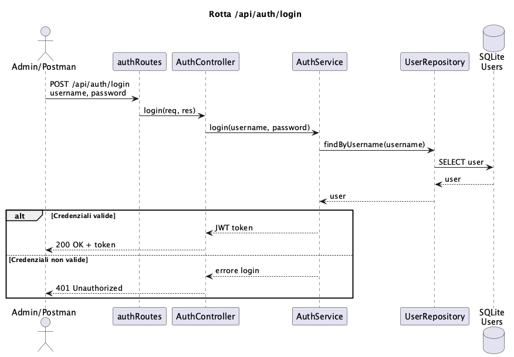
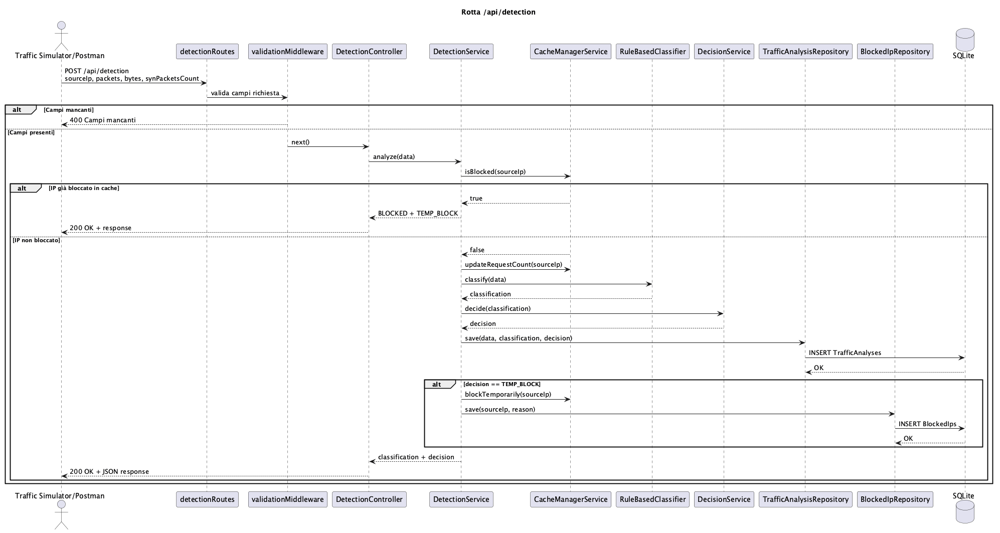
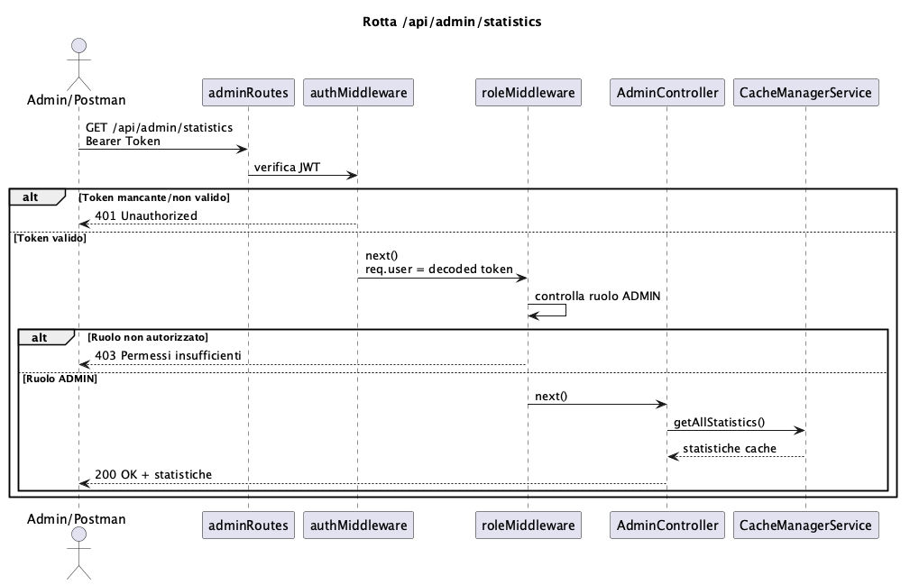
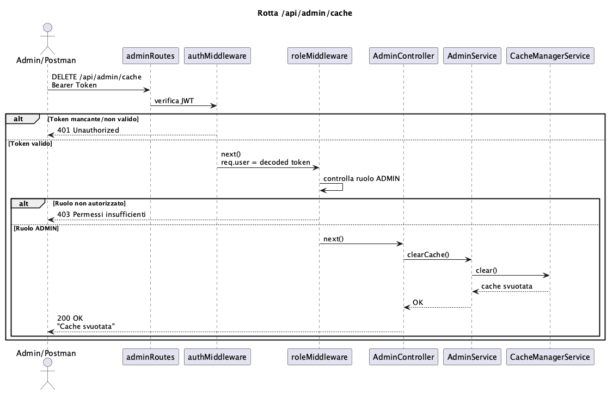

# Sistema multi-utente per il rilevamento di attacchi di rete basato su architettura client-server

Il sistema sviluppato si inserisce in un contesto applicativo in cui è necessario monitorare il traffico di rete per individuare possibili attività sospette.
Nell'infrastruttura ipotizzata, infatti, più client o utenti possono generare traffico verso un backend centrale, mentre un sistema di analisi si occupa di elaborare i flussi ricevuti e segnalare eventuali comportamenti anomali.

## Obiettivo del progetto

Il presente progetto simula tale scenario attraverso l'impiego di un'architettura client-server, all'interno della quale il client invia al backend richieste contenenti feature estratte da flussi di rete.
Nello specifico, sono state selezionate quattro features:
- **sourceIP**, ovvero l'indirizzo sorgente del traffico, che identidica l'host che genera i pacchetti;
- **packets**, cioè il numero dei pacchetti inviati in un intervallo di tempo specifico, utile per individuare il volume di traffico anomalo;
- **bytes**, ovvero la quantità totale di bytes trasmessi nella comunicazione tra client (host) e service;
- **synPacketsCount**, cioè l numero di pacchetti TCP che possiedono la flag SYN, che costituisce una caratteristica rilevante nell'osservazione del traffico di rete, per individuare attacchi SYN Flood;

Nello specifico, il backend riceve le richieste tramite API REST sviluppate con Node.js, Express e TypeScript, quindi verifica autenticazione e autorizzazione mediante JWT, e poi valida i dati ricevuti e avvia la pipeline di elaborazione.

Il traffico viene classificato tramite un approccio rule-based, basato su regole e soglie predefinite, distinguendo tra:
- traffico benigno
- attacchi DoS
- tentativi di Brute Force

Sulla base della classificazione ottenuta, il sistema produce una decisione operativa tra: consentire la richiesta, generare un avviso o applicare un blocco temporaneo oppure uno permanente.

Il sistema include inoltre una componente di persistenza dei dati basata sull'utilizzo di database relazionale esterno, interfacciato mediante Sequelize, così da memorizzare le analisi effettuate e mantenere uno storico delle richieste analizzate.

Le informazioni salvate possono essere consultate attraverso rotte protette riservate agli utenti amministratori.

## Strumenti per lo sviluppo

- Node.JS
- Express
- TypeScript
- Sequelize
- SQLite
- JWT
- Docker
- Jest
- Postman

## Diagrammi UML

### Diagramma dei casi d'uso


### Diagramma di sequenza

#### Rotta /api/auth/login
<p align="center">

</p>

#### Rotta /api/detection
<p align="center">

</p>

#### Rotta /api/admin/statistics
<p align="center">

</p>

#### Rotta /api/admin/analysis
<p align="center">

</p>

#### Rotta /api/admin/cache
<p align="center">

</p>


## Design Pattern utilizzati

Il progetto adotta diversi pattern software al fine di garantire separazione delle responsabilità, facilità di manutenzione ed estendibilità del codice:

- **Layered Architecture**
    Il progetto è organizzato a livelli, affinchè ogni livello abbia una responsabilità precisa.
    Nello specifico, i livelli realizzati sono:
    - **Routes**
      è il livello che contiene le rotte, che definiscono gli edpoint API e associano ogni URL al controller corretto. 
    - **Middleware**
      è il livello che contiene i middleware, che intercettano le richieste HTTP prima che giugnano ai controllers, ed eseguono le operazioni di autenticazione, validazione dei dati e gestione degli errori. 
    - **Controller**
      è il livello che si costiuisce dei controllers, che ricevono la richiesta HTTP e la inoltrano al service appropriato, senza applicare alcuna logica applicativa.
    - **Service**
      è il livello che contiene i service, che implementano le logiche applicative del sistema, coordinano le varie operazioni.
    - **Repository**
      è il livello che contiene i repository, che gestiscono l'accesso ai dati sul database.
    - **Model**
      è il livello che contiene i modelli Sequelize, che servono a rappresentare in TypeScript le tabelle presenti all'interno del database SQLite usato dall'applicazione, permettendo di fatto il dialogo tra applicazione e database.

- **Repository Pattern**
  Il Repository Pattern è stato usato per **separare la logica applicativa dalle operazioni di persistenza dei dati, evitando che i services interagissero direttamente con il database**.
  Infatti, come sopra riportato:
  - il service implementa la logica applicativa relativa alla specifica funzionalità (autenticazione, rilevamento degli attacchi, gestione operazioni amministrative)
  - la repository contiene le operazioni di accesso ai dati del database SQLite (lettura, scrittura, e ricerca) delegate da parte del service, e utilizza i modelli sequelize per eseguirele sul database.

  Gli esempi di Repository Pattern sono applicati nelle seguenti fasi:

  - autenticazione
     in quanto l'`AuthService.ts` non interroga direttamente il database tramite il modello Sequelize `User.findOne()`, ma delega la ricerca dell'utente al metodo `UserRepository.findByUsername()` (che incapsula al proprio interno l'utilizzo del modello Sequelize)

  - rilevamento degli attacchi (detection)
     in quanto il `DetectionService.ts` delega le operazioni di persistenza ai repository `TrafficAnalysisRepository.ts` e `BlockedIpRepository.ts`, che utilizzano i rispettivi modelli Sequelize per eseguire le operazioni di lettura e scrittura sul database

  - attuazione della rotta amministrativa `/api/admin/analysis`
     in quanto l'`AdminService.ts`, per effettuare l'osservazione dello storico del traffico, richiama delega il metodo `TrafficAnalysisRepository.findAll()` che utilizza il modello Sequelize per recuperare tutti i record presenti nel database

     Per quanto riguarda le altre due rotte amministrative, `/api/admin/statistics` e `/api/admin/cache`, l'`AdminService.ts` non chiama alcun repository poichè le statistiche e l'operazione di svuotamento della cache vengono eseguite direttamente chiamando rispettivamente `CacheManagerService.getAllStatistics()` e `CacheManagerService.clear()`.

- **Strategy Pattern**
  Lo Strategy Pattern è stato utilizzato **per separare la logica di classificazione del traffico di rete dalla logica applicativa**, qualora in futuro si necessitasse di introdurre un nuovo algoritmo di classificazione: nello specifico, basterebbe solo creare una nuova classe che sia in grado di implementare l'interfaccia `Classifier.ts`, evitando di intaccare il codice relativo al `DetectionService.ts`.

  Per fare ciò è stata definita l'interfaccia `Classifier.ts` che serve a chiamare un qualunque classificatore che possieda il metodo `classify(data)`.

  L'implementazione concreta del metodo è attuata dalla classe `RuledBasedClassifier.ts`, che produce la classificazione del traffico in termini di `BENIGN`, `DOS` e `BRUTE_FORCE`.

  Il `DetectionService.ts` utilizza quindi un oggetto che implementa l'interfaccia `Classifier.ts`, ichiamando il relativo metodo `classify(data)` per ottenere la classificazione del traffico.


## Installazione

### Requisiti

Docker Desktop installato

### Avvio

Il progetto si avvia tramite **Docker Compose**, effettuando la procedura seguente: 
1. clonare il repository con il comando

```bash
git clone https://github.com/Ceciliaaa3110/Project_PA.git
```
2. entrare nella cartella del progetto
```bash
cd Projeect_PA
```
3. entrare nella cartella del backend, per raggiungere il file `docker-compose.yml`
```bash
cd backend
```
4. generare l'immagine docker dell'applicazione, ricostruendola senza usare la cache

```bash
docker compose build --no-cache
```
4. avvio dei servizi definiti nel file `docker-compose.yml`
```bash
docker compose up
```

Quindi aprire un secondo terminale, posizionandosi nella cartella `backend`, per poi eseguire il simulatore di traffico
```bash
npm run simulate
```
Aprire **Postman** e importare la collection `ProjectPA.postman_collection.json`: da Postman è possibile inviare le richieste agli endpoint dell'applicazione.


## Configurazione

Il file `.env` contiene la variabile d'ambiente `JWT_SECRET` utilizzata come chiave segreta per la firma e la verifica dei token JWT durante il processo di autenticazione.

Il file `docker-compose.yml` definisce i servizi Docker necessari all'esecuzione del progetto e ne automatizza l'avvio

Il file `seedUsers.ts` inizializza il database `database.sqlite` creando, in caso di assenza, un utente amministratore con password memorizzata come hash generato con bcrypt.

Il file `TrafficSimulator.ts` genera il traffico di rete simulato.

## Test

### Test middleware con JEST

I middleware scelti per questa tipologia di testing sono i seguenti:

- **validationMiddleware**
  è il middleware che si occupa di controllare che la richiesta inviata alla rotta `/api/detection` contenga tutti i campi necessari: `sourceIP`, `packets`, `bytes`, e `synPacketsCount`.
  I relativi test JEST garantiscono che:
  - in caso di presenza di tutti i campi,  venga invocata la funzione `next()`
  - in caso di campi mancanti, venga restituito un errore HTTP `400 Bad request`

- **roleMiddleware**
  è il middleware che controlla che un utente autenticato abbia il ruolo richiesto ad accedere alle rotte amministrative.
  I relativi test JEST garantiscono che:
  - la richiesta di un utente con ruolo compatibile possa essere elaborata
  - la richiesta di utente non autorizzato venga interrotta e si associata alla restituzione di un errore HTTP `403 Forbidden`.

L'immagine seguente mostra il superamento di entrambe le suite di test implementate, per un totale di quattro test superati.


### Test API

Le API sono state testate manualmente tramite **Postman**, utilizzando la collection `ProjectPA.postman_collection.json` contenente tutte le rotte implementate dal sistema.

Sono stati verificati sia i casi di successo, che quelli di errore per le operazioni di autenticazione, rilevamento del traffico, consultazione delle statistiche, recupero dello storico delle analisi, e pulizia della cache.

## Autore

Cecilia Lisci

## License

MIT License

Copyright © 2026 Cecilia Lisci